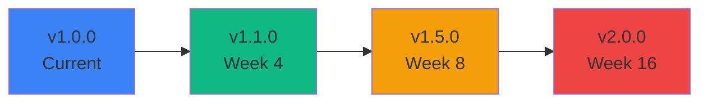

# 🗺️ Roadmap Pengembangan Celengan Digital

<div align="center">


**Q1-Q2 2026** | **Start Date:** 14 Januari 2026

</div>

---

## 📊 Overall Progress

```
Phase 1: Critical Improvements        [██░░░░░░░░] 20% (2 weeks)
Phase 2: Security & Performance       [░░░░░░░░░░]  0% (2 weeks)
Phase 3: Enhanced Features            [░░░░░░░░░░]  0% (4 weeks)
Phase 4: Advanced Features            [░░░░░░░░░░]  0% (4 weeks)
Phase 5: Polish & Optimization        [░░░░░░░░░░]  0% (4 weeks)
─────────────────────────────────────────────────────
Total Progress:                       [█░░░░░░░░░]  5%
```

**Legend:**
- 🔴 **Critical** - Must have, blocking other features
- 🟠 **High** - Very important, should be done ASAP
- 🟡 **Medium** - Important but can wait
- 🟢 **Low** - Nice to have

---

## 📑 Quick Navigation

| Phase | Focus Area | Duration | Status |
|-------|-----------|----------|--------|
| [Phase 1](#phase-1-critical-improvements-minggu-1-2) | Critical Improvements | 2 weeks | 🟡 In Progress |
| [Phase 2](#phase-2-security--performance-minggu-3-4) | Security & Performance | 2 weeks | ⚪ Not Started |
| [Phase 3](#phase-3-enhanced-features-minggu-5-8) | Enhanced Features | 4 weeks | ⚪ Not Started |
| [Phase 4](#phase-4-advanced-features-minggu-9-12) | Advanced Features | 4 weeks | ⚪ Not Started |
| [Phase 5](#phase-5-polish--optimization-minggu-13-16) | Polish & Optimization | 4 weeks | ⚪ Not Started |

---

## 🎯 Version Roadmap



---

## Phase 1: Critical Improvements (Minggu 1-2)

**🎯 Goal:** Memperbaiki fondasi dan struktur project  
**📅 Timeline:** Week 1-2 (14-27 Januari 2026)  
**🎖️ Priority:** 🔴 Critical  
**📈 Progress:** 20%

---

### Week 1: Database & Code Structure
**📅 14-20 Januari 2026**

#### ✅ Task 1.1: Database Setup
**Priority:** 🔴 Critical | **Status:** ✅ Completed | **Time:** ~2 hours

- [x] Buat folder `database/`
- [x] Buat `database/db_celengan.sql` dengan full schema
- [x] Include CREATE DATABASE statement
- [x] Include semua CREATE TABLE (users, celengan, transaksi)
- [x] Include TRIGGER `transaksi_after_delete`
- [x] Include sample data untuk testing
- [x] Include indexes & foreign keys
- [x] Dokumentasi relasi antar tabel

**✅ Completed on:** 14 Januari 2026

---

#### 🔄 Task 1.2: Restructure Assets
**Priority:** 🔴 Critical | **Status:** 🔄 In Progress | **Est. Time:** ~4 hours

**Subtasks:**

- [ ] **CSS Separation** (2 hours)
  - [ ] Extract inline CSS dari `dashboard/index.php` → `assets/css/dashboard.css`
  - [ ] Extract inline CSS dari `dashboard/detail-celengan.php` → `assets/css/detail.css`
  - [ ] Extract inline CSS dari auth pages → `assets/css/auth.css`
  - [ ] Extract inline CSS dari form pages → `assets/css/forms.css`
  - [ ] Buat `assets/css/variables.css` untuk CSS custom properties
  - [ ] Buat `assets/css/dark-mode.css` untuk dark mode styles
  - [ ] Update semua file PHP untuk include CSS files

- [ ] **JavaScript Separation** (2 hours)
  - [ ] Extract inline JS dari dashboard → `assets/js/dashboard.js`
  - [ ] Extract inline JS dari detail → `assets/js/detail.js`
  - [ ] Buat `assets/js/theme.js` untuk dark mode toggle
  - [ ] Buat `assets/js/validation.js` untuk form validation
  - [ ] Buat `assets/js/chart-config.js` untuk Chart.js configs
  - [ ] Buat `assets/js/modal.js` untuk modal handlers
  - [ ] Update semua file PHP untuk include JS files

**Dependencies:** None  
**Blocks:** Task 2.3 (Asset Optimization)

---

#### 🔄 Task 1.3: Config Centralization
**Priority:** 🟠 High | **Status:** ⚪ Not Started | **Est. Time:** ~1 hour

- [ ] Buat `config/config.php`
- [ ] Define application constants:
  ```php
  // App Info
  define('APP_NAME', 'Celengan Digital');
  define('APP_VERSION', '1.0.0');
  define('APP_URL', 'http://localhost/celengan digital/');
  
  // Features
  define('MAX_PINNED_CELENGAN', 3);
  define('MAX_FILE_SIZE', 2097152); // 2MB
  
  // Formats
  define('DATE_FORMAT', 'd/m/Y');
  define('CURRENCY_SYMBOL', 'Rp');
  define('CURRENCY_DECIMAL', 0);
  
  // Paths
  define('UPLOAD_PATH', __DIR__ . '/../uploads/');
  define('LOG_PATH', __DIR__ . '/../logs/');
  ```
- [ ] Include config.php di semua file yang membutuhkan
- [ ] Replace hardcoded values dengan constants

**Dependencies:** None

---

### Week 2: Reusable Components & Functions
**📅 21-27 Januari 2026**

#### 🔄 Task 1.4: Create Reusable Components
**Priority:** 🟠 High | **Status:** ⚪ Not Started | **Est. Time:** ~3 hours

- [ ] **Header Component** (30 min)
  - [ ] Buat `includes/header.php`
  - [ ] Include meta tags, title, CSS links
  - [ ] Support dynamic page title

- [ ] **Navbar Component** (1 hour)
  - [ ] Buat `includes/navbar.php`
  - [ ] Include user info, dark mode toggle, logout button
  - [ ] Support active menu highlighting

- [ ] **Footer Component** (30 min)
  - [ ] Buat `includes/footer.php`
  - [ ] Include copyright, version info
  - [ ] Include common JS scripts

- [ ] **Modal Component** (1 hour)
  - [ ] Buat `includes/modal.php`
  - [ ] Support different modal types (success, error, confirm)
  - [ ] Reusable modal structure

**Dependencies:** Task 1.2 (CSS/JS separation)

---

#### 🔄 Task 1.5: Helper Functions Library
**Priority:** 🟠 High | **Status:** ⚪ Not Started | **Est. Time:** ~2 hours

- [ ] Buat `includes/functions.php`
- [ ] Implement helper functions:
  ```php
  // Currency Formatting
  function rupiah($angka) { }
  
  // Date Formatting
  function tanggal_indo($date) { }
  function waktu_lalu($timestamp) { }
  
  // Input Sanitization
  function sanitize_input($data) { }
  function sanitize_html($data) { }
  
  // Redirect
  function redirect($url, $permanent = false) { }
  
  // Flash Messages
  function set_flash($type, $message) { }
  function get_flash() { }
  function has_flash() { }
  
  // Progress Calculation
  function calculate_progress($current, $target) { }
  function progress_percentage($current, $target) { }
  
  // Validation
  function validate_email($email) { }
  function validate_password($password) { }
  
  // File Upload
  function upload_image($file, $path) { }
  function delete_file($path) { }
  ```
- [ ] Include functions.php di semua file
- [ ] Replace duplicate code dengan helper functions

**Dependencies:** Task 1.3 (Config)

---

### 📦 Phase 1 Deliverables

- ✅ Database SQL file lengkap di folder `database/`
- 🔄 CSS terpisah di folder `assets/css/`
- 🔄 JavaScript terpisah di folder `assets/js/`
- 🔄 Config centralization di `config/config.php`
- 🔄 Reusable components di folder `includes/`
- 🔄 Helper functions library
- 🔄 Code yang lebih maintainable dan DRY

---

## Phase 2: Security & Performance (Minggu 3-4)

**🎯 Goal:** Meningkatkan keamanan dan performa aplikasi  
**📅 Timeline:** Week 3-4 (28 Januari - 10 Februari 2026)  
**🎖️ Priority:** 🔴 Critical  
**📈 Progress:** 0%

---

### Week 3: Security Enhancements
**📅 28 Januari - 3 Februari 2026**

#### 🔄 Task 2.1: CSRF Protection
**Priority:** 🔴 Critical | **Status:** ⚪ Not Started | **Est. Time:** ~3 hours

- [ ] **CSRF Token Generator** (1 hour)
  - [ ] Buat `config/csrf.php`
  - [ ] Function `generate_csrf_token()`
  - [ ] Function `validate_csrf_token($token)`
  - [ ] Store token di session
  - [ ] Auto-regenerate setelah validation

- [ ] **Form Integration** (2 hours)
  - [ ] Tambahkan hidden input CSRF di semua form
  - [ ] Validate token di semua API endpoints:
    - [ ] `auth/api/proses-login.php`
    - [ ] `auth/api/proses-register.php`
    - [ ] `data-celengan/api/api-tambah-celengan.php`
    - [ ] `data-celengan/api/api-edit-celengan.php`
    - [ ] `data-celengan/api/api-toggle-pin.php`
    - [ ] `transaksi/api/api-tambah-transaksi.php`
    - [ ] `transaksi/api/api-edit-transaksi.php`
  - [ ] Return proper error jika token invalid

**Dependencies:** None  
**Impact:** 🔒 Prevents CSRF attacks

---

#### 🔄 Task 2.2: Rate Limiting
**Priority:** 🔴 Critical | **Status:** ⚪ Not Started | **Est. Time:** ~4 hours

- [ ] **Database Table** (30 min)
  ```sql
  CREATE TABLE login_attempts (
    id INT AUTO_INCREMENT PRIMARY KEY,
    ip_address VARCHAR(45) NOT NULL,
    email VARCHAR(150),
    attempt_time TIMESTAMP DEFAULT CURRENT_TIMESTAMP,
    success TINYINT(1) DEFAULT 0,
    INDEX idx_ip_time (ip_address, attempt_time)
  );
  ```

- [ ] **Rate Limiter Class** (2 hours)
  - [ ] Buat `includes/RateLimiter.php`
  - [ ] Track login attempts by IP
  - [ ] Max 5 attempts per 5 minutes
  - [ ] Lock account temporarily
  - [ ] Clean old attempts (older than 24 hours)

- [ ] **Integration** (1.5 hours)
  - [ ] Implement di `auth/api/proses-login.php`
  - [ ] Implement di `auth/api/proses-register.php`
  - [ ] Show countdown timer saat locked
  - [ ] Email notification untuk suspicious activity (optional)

**Dependencies:** None  
**Impact:** 🔒 Prevents brute force attacks

---

#### 🔄 Task 2.3: Enhanced Input Validation
**Priority:** 🟠 High | **Status:** ⚪ Not Started | **Est. Time:** ~3 hours

- [ ] **Client-Side Validation** (2 hours)
  - [ ] Buat `assets/js/validation.js`
  - [ ] Real-time validation untuk:
    - [ ] Email format
    - [ ] Password strength (min 8 char, uppercase, lowercase, number)
    - [ ] Username (alphanumeric, min 3 char)
    - [ ] Nominal (numeric, positive)
    - [ ] Nama celengan (max length)
  - [ ] Visual feedback (error messages, color indicators)
  - [ ] Disable submit jika validation gagal

- [ ] **Server-Side Enhancement** (1 hour)
  - [ ] Strengthen validation di semua API
  - [ ] Custom error messages yang user-friendly
  - [ ] Log validation failures

**Dependencies:** Task 1.2 (JS separation)  
**Impact:** ✨ Better UX, stronger security

---

#### 🔄 Task 2.4: .htaccess Security
**Priority:** 🟠 High | **Status:** ⚪ Not Started | **Est. Time:** ~1 hour

- [ ] Buat `.htaccess` di root folder
- [ ] Security headers:
  ```apache
  # Security Headers
  Header set X-Frame-Options "SAMEORIGIN"
  Header set X-XSS-Protection "1; mode=block"
  Header set X-Content-Type-Options "nosniff"
  Header set Referrer-Policy "strict-origin-when-cross-origin"
  
  # Disable Directory Listing
  Options -Indexes
  
  # Block Access to Sensitive Files
  <FilesMatch "\.(env|git|sql|log|md)$">
    Order allow,deny
    Deny from all
  </FilesMatch>
  
  # Force HTTPS (production only)
  # RewriteEngine On
  # RewriteCond %{HTTPS} off
  # RewriteRule ^(.*)$ https://%{HTTP_HOST}%{REQUEST_URI} [L,R=301]
  ```
- [ ] Test di localhost
- [ ] Document untuk production deployment

**Dependencies:** None  
**Impact:** 🔒 Enhanced security headers

---

### Week 4: Performance Optimization
**📅 4-10 Februari 2026**

#### 🔄 Task 2.5: Asset Optimization
**Priority:** 🟡 Medium | **Status:** ⚪ Not Started | **Est. Time:** ~3 hours

- [ ] **CSS Minification** (1 hour)
  - [ ] Install CSS minifier (manual atau tool)
  - [ ] Minify semua CSS files
  - [ ] Create `.min.css` versions
  - [ ] Update references di PHP files

- [ ] **JavaScript Minification** (1 hour)
  - [ ] Install JS minifier
  - [ ] Minify semua JS files
  - [ ] Create `.min.js` versions
  - [ ] Update references di PHP files

- [ ] **Image Optimization** (1 hour)
  - [ ] Compress existing images
  - [ ] Convert to WebP format (jika ada)
  - [ ] Implement lazy loading untuk images

**Dependencies:** Task 1.2 (Asset separation)  
**Impact:** ⚡ Faster page load

---

#### 🔄 Task 2.6: Caching Strategy
**Priority:** 🟡 Medium | **Status:** ⚪ Not Started | **Est. Time:** ~2 hours

- [ ] **Browser Caching** (30 min)
  - [ ] Add caching headers di `.htaccess`
  ```apache
  # Browser Caching
  <IfModule mod_expires.c>
    ExpiresActive On
    ExpiresByType text/css "access plus 1 month"
    ExpiresByType application/javascript "access plus 1 month"
    ExpiresByType image/jpeg "access plus 1 year"
    ExpiresByType image/png "access plus 1 year"
    ExpiresByType image/webp "access plus 1 year"
  </IfModule>
  ```

- [ ] **Database Query Caching** (1 hour)
  - [ ] Cache dashboard statistics
  - [ ] Cache user preferences
  - [ ] Implement cache invalidation

- [ ] **LocalStorage Caching** (30 min)
  - [ ] Cache dark mode preference
  - [ ] Cache sort preference
  - [ ] Cache user settings

**Dependencies:** Task 2.4 (.htaccess)  
**Impact:** ⚡ Reduced server load, faster response

---

#### 🔄 Task 2.7: CDN Fallback
**Priority:** 🟢 Low | **Status:** ⚪ Not Started | **Est. Time:** ~2 hours

- [ ] **Download Libraries Locally** (1 hour)
  - [ ] Download Chart.js v4.4.1
  - [ ] Download chartjs-plugin-zoom v2.0.1
  - [ ] Download Hammer.js v2.0.8
  - [ ] Download Bootstrap Icons v1.11.3
  - [ ] Download Google Fonts (Inter)
  - [ ] Save to `assets/vendor/`

- [ ] **Implement Fallback Logic** (1 hour)
  - [ ] Try CDN first
  - [ ] Fallback to local if CDN fails
  - [ ] Test offline functionality

**Dependencies:** None  
**Impact:** 🌐 Offline capability

---

### 📦 Phase 2 Deliverables

- 🔒 CSRF protection di semua form
- 🔒 Rate limiting untuk login/register
- ✨ Enhanced input validation (client + server)
- 🔒 Security headers via .htaccess
- ⚡ Minified CSS & JavaScript
- ⚡ Browser caching strategy
- 🌐 CDN fallback untuk offline access
- 📊 Performance improvement: 30-50% faster load time

---

## Phase 3: Enhanced Features (Minggu 5-8)

**🎯 Goal:** Menambahkan fitur yang meningkatkan user experience  
**📅 Timeline:** Week 5-8 (11 Februari - 10 Maret 2026)  
**🎖️ Priority:** 🟠 High  
**📈 Progress:** 0%

---

### Week 5: Profile Management
**📅 11-17 Februari 2026**

#### 🔄 Task 3.1: User Profile Page
**Priority:** 🟠 High | **Status:** ⚪ Not Started | **Est. Time:** ~5 hours

- [ ] **Database Schema** (30 min)
  ```sql
  ALTER TABLE users ADD COLUMN profile_photo VARCHAR(255) DEFAULT NULL;
  ALTER TABLE users ADD COLUMN phone VARCHAR(20) DEFAULT NULL;
  ALTER TABLE users ADD COLUMN bio TEXT DEFAULT NULL;
  ```

- [ ] **Profile Page UI** (2 hours)
  - [ ] Buat `auth/profile.php`
  - [ ] Display current user info
  - [ ] Edit username & email form
  - [ ] Change password form
  - [ ] Upload foto profil
  - [ ] Glassmorphism design consistency

- [ ] **Backend Logic** (2.5 hours)
  - [ ] Buat `auth/api/update-profile.php`
  - [ ] Validate input (unique email, username)
  - [ ] Handle foto upload
  - [ ] Image validation (size max 2MB, type: jpg/png)
  - [ ] Image resize & optimization (max 500x500px)
  - [ ] Update database
  - [ ] Return JSON response

**Dependencies:** Task 1.5 (Helper functions)  
**Impact:** ✨ Better user management

---

#### 🔄 Task 3.2: Change Password
**Priority:** 🟠 High | **Status:** ⚪ Not Started | **Est. Time:** ~2 hours

- [ ] **UI Form** (30 min)
  - [ ] Old password field
  - [ ] New password field
  - [ ] Confirm password field
  - [ ] Password strength indicator

- [ ] **Backend** (1.5 hours)
  - [ ] Buat `auth/api/change-password.php`
  - [ ] Verify old password
  - [ ] Validate new password (min 8 char, complexity)
  - [ ] Hash new password
  - [ ] Update database
  - [ ] Force re-login (optional)

**Dependencies:** Task 3.1  
**Impact:** 🔒 Security enhancement

---

#### 🔄 Task 3.3: Forgot Password
**Priority:** 🟠 High | **Status:** ⚪ Not Started | **Est. Time:** ~6 hours

- [ ] **Database Table** (30 min)
  ```sql
  CREATE TABLE password_resets (
    id INT AUTO_INCREMENT PRIMARY KEY,
    email VARCHAR(150) NOT NULL,
    token VARCHAR(255) NOT NULL,
    created_at TIMESTAMP DEFAULT CURRENT_TIMESTAMP,
    expires_at TIMESTAMP NOT NULL,
    used TINYINT(1) DEFAULT 0,
    INDEX idx_token (token),
    INDEX idx_email (email)
  );
  ```

- [ ] **Forgot Password Page** (1 hour)
  - [ ] Buat `auth/forgot-password.php`
  - [ ] Email input form
  - [ ] Send reset link button

- [ ] **Email Integration** (2 hours)
  - [ ] Install PHPMailer via Composer
  - [ ] Configure SMTP settings
  - [ ] Buat email template
  - [ ] Send reset link via email

- [ ] **Reset Password Page** (1.5 hours)
  - [ ] Buat `auth/reset-password.php?token=xxx`
  - [ ] Validate token (exists, not expired, not used)
  - [ ] New password form
  - [ ] Update password
  - [ ] Mark token as used

- [ ] **Backend API** (1 hour)
  - [ ] `auth/api/request-reset.php`
  - [ ] `auth/api/reset-password.php`

**Dependencies:** None  
**Impact:** ✨ Essential user feature

---

### Week 6: Kategori Celengan
**📅 18-24 Februari 2026**

#### 🔄 Task 3.4: Kategori System
**Priority:** 🟡 Medium | **Status:** ⚪ Not Started | **Est. Time:** ~5 hours

- [ ] **Database Schema** (30 min)
  ```sql
  CREATE TABLE kategori_celengan (
    id INT AUTO_INCREMENT PRIMARY KEY,
    nama VARCHAR(100) NOT NULL,
    icon VARCHAR(50) DEFAULT 'bi-piggy-bank',
    color VARCHAR(7) DEFAULT '#667eea',
    created_at TIMESTAMP DEFAULT CURRENT_TIMESTAMP
  );
  
  INSERT INTO kategori_celengan (nama, icon, color) VALUES
  ('Liburan', 'bi-airplane', '#3b82f6'),
  ('Gadget', 'bi-phone', '#8b5cf6'),
  ('Darurat', 'bi-shield-exclamation', '#ef4444'),
  ('Pendidikan', 'bi-book', '#10b981'),
  ('Investasi', 'bi-graph-up', '#f59e0b'),
  ('Lainnya', 'bi-three-dots', '#6b7280');
  
  ALTER TABLE celengan ADD COLUMN kategori_id INT DEFAULT NULL;
  ALTER TABLE celengan ADD FOREIGN KEY (kategori_id) REFERENCES kategori_celengan(id);
  ```

- [ ] **CRUD Kategori** (2 hours)
  - [ ] Buat `kategori/index.php` (list)
  - [ ] Buat `kategori/tambah.php`
  - [ ] Buat `kategori/edit.php`
  - [ ] Buat `kategori/hapus.php`
  - [ ] API endpoints

- [ ] **Update Celengan Forms** (1.5 hours)
  - [ ] Add kategori dropdown di `tambah-celengan.php`
  - [ ] Add kategori dropdown di `edit-celengan.php`
  - [ ] Update API to save kategori_id

- [ ] **Dashboard Integration** (1 hour)
  - [ ] Show kategori badge di celengan card
  - [ ] Filter by kategori
  - [ ] Color coding per kategori

**Dependencies:** None  
**Impact:** 📊 Better organization

---

### Week 7: Export Data
**📅 25 Februari - 3 Maret 2026**

#### 🔄 Task 3.5: Export to PDF
**Priority:** 🟡 Medium | **Status:** ⚪ Not Started | **Est. Time:** ~6 hours

- [ ] **Install Library** (30 min)
  - [ ] Install TCPDF via Composer
  - [ ] Configure TCPDF

- [ ] **PDF Templates** (3 hours)
  - [ ] Buat `exports/celengan-pdf.php`
  - [ ] Template untuk detail celengan
  - [ ] Include grafik (Chart.js to image)
  - [ ] Include transaksi list
  - [ ] Custom branding (logo, colors)

- [ ] **Export Functionality** (2.5 hours)
  - [ ] Export button di detail celengan
  - [ ] Generate PDF on-the-fly
  - [ ] Download PDF
  - [ ] Export laporan bulanan
  - [ ] Export summary semua celengan

**Dependencies:** None  
**Impact:** 📄 Professional reporting

---

#### 🔄 Task 3.6: Export to Excel
**Priority:** 🟡 Medium | **Status:** ⚪ Not Started | **Est. Time:** ~4 hours

- [ ] **Install Library** (30 min)
  - [ ] Install PhpSpreadsheet via Composer

- [ ] **Excel Export** (3.5 hours)
  - [ ] Buat `exports/celengan-excel.php`
  - [ ] Export semua celengan
  - [ ] Export transaksi per celengan
  - [ ] Auto-format cells (currency, date)
  - [ ] Include summary & statistics
  - [ ] Multiple sheets (overview, detail, transaksi)

**Dependencies:** None  
**Impact:** 📊 Data portability

---

### Week 8: Enhanced Statistics
**📅 4-10 Maret 2026**

#### 🔄 Task 3.7: Advanced Charts
**Priority:** 🟡 Medium | **Status:** ⚪ Not Started | **Est. Time:** ~5 hours

- [ ] **Comparison Charts** (2 hours)
  - [ ] Bar chart: perbandingan saldo antar celengan
  - [ ] Pie chart: distribusi saldo
  - [ ] Stacked bar: progress vs target

- [ ] **Trend Analysis** (2 hours)
  - [ ] Line chart: monthly savings trend
  - [ ] Area chart: cumulative savings
  - [ ] Multi-line: compare multiple celengan

- [ ] **Interactive Features** (1 hour)
  - [ ] Tooltips dengan detail
  - [ ] Click to drill down
  - [ ] Export chart as image

**Dependencies:** Task 1.2 (Chart config separation)  
**Impact:** 📈 Better insights

---

#### 🔄 Task 3.8: Statistics Dashboard
**Priority:** 🟡 Medium | **Status:** ⚪ Not Started | **Est. Time:** ~4 hours

- [ ] **New Statistics** (3 hours)
  - [ ] Total savings this month/year
  - [ ] Average saving rate (per day/week/month)
  - [ ] Most active celengan (most transactions)
  - [ ] Fastest growing celengan
  - [ ] Completion rate (% celengan tercapai)
  - [ ] Spending analysis (keluar vs masuk)

- [ ] **UI Cards** (1 hour)
  - [ ] Stat cards dengan icons
  - [ ] Animated counters
  - [ ] Trend indicators (up/down)

**Dependencies:** None  
**Impact:** 📊 Actionable insights

---

### 📦 Phase 3 Deliverables

- ✨ Complete profile management
- 🔒 Forgot password functionality
- 📊 Kategori system untuk better organization
- 📄 Export to PDF & Excel
- 📈 Advanced charts & statistics
- 🎯 User engagement improvement: 40%+

---

## Phase 4: Advanced Features (Minggu 9-12)

**🎯 Goal:** Fitur-fitur canggih yang membedakan dari kompetitor  
**📅 Timeline:** Week 9-12 (11 Maret - 7 April 2026)  
**🎖️ Priority:** 🟡 Medium  
**📈 Progress:** 0%

---

### Week 9: PWA (Progressive Web App)
**📅 11-17 Maret 2026**

#### 🔄 Task 4.1: PWA Setup
**Priority:** 🟡 Medium | **Status:** ⚪ Not Started | **Est. Time:** ~6 hours

- [ ] **Manifest File** (1 hour)
  - [ ] Buat `manifest.json`
  ```json
  {
    "name": "Celengan Digital",
    "short_name": "Celengan",
    "description": "Aplikasi manajemen tabungan digital",
    "start_url": "/",
    "display": "standalone",
    "background_color": "#667eea",
    "theme_color": "#667eea",
    "icons": [...]
  }
  ```

- [ ] **App Icons** (1 hour)
  - [ ] Generate icons (192x192, 512x512)
  - [ ] Maskable icons
  - [ ] Favicon set

- [ ] **Service Worker** (3 hours)
  - [ ] Buat `service-worker.js`
  - [ ] Cache strategy (Cache First, Network First)
  - [ ] Cache static assets (CSS, JS, images)
  - [ ] Cache API responses
  - [ ] Background sync

- [ ] **Install Prompt** (1 hour)
  - [ ] Detect if installable
  - [ ] Show install banner
  - [ ] Handle install event

**Dependencies:** Task 1.2 (Asset separation)  
**Impact:** 📱 Native app experience

---

#### 🔄 Task 4.2: Offline Capability
**Priority:** 🟡 Medium | **Status:** ⚪ Not Started | **Est. Time:** ~4 hours

- [ ] **Offline Detection** (1 hour)
  - [ ] Detect online/offline status
  - [ ] Show offline indicator
  - [ ] Queue actions saat offline

- [ ] **Data Sync** (2 hours)
  - [ ] Store offline actions di IndexedDB
  - [ ] Sync saat online kembali
  - [ ] Conflict resolution

- [ ] **Offline UI** (1 hour)
  - [ ] Show cached data
  - [ ] Disable actions yang require network
  - [ ] Informative messages

**Dependencies:** Task 4.1  
**Impact:** 🌐 Works offline

---

### Week 10: Notification System
**📅 18-24 Maret 2026**

#### 🔄 Task 4.3: In-App Notifications
**Priority:** 🟡 Medium | **Status:** ⚪ Not Started | **Est. Time:** ~5 hours

- [ ] **Database Table** (30 min)
  ```sql
  CREATE TABLE notifications (
    id INT AUTO_INCREMENT PRIMARY KEY,
    user_id INT NOT NULL,
    title VARCHAR(255) NOT NULL,
    message TEXT NOT NULL,
    type ENUM('info', 'success', 'warning', 'error') DEFAULT 'info',
    is_read TINYINT(1) DEFAULT 0,
    created_at TIMESTAMP DEFAULT CURRENT_TIMESTAMP,
    FOREIGN KEY (user_id) REFERENCES users(id) ON DELETE CASCADE
  );
  ```

- [ ] **Notification Bell** (2 hours)
  - [ ] Bell icon di navbar
  - [ ] Badge untuk unread count
  - [ ] Dropdown notification list
  - [ ] Mark as read functionality

- [ ] **Auto Notifications** (2.5 hours)
  - [ ] Target tercapai
  - [ ] 50%, 75%, 90% progress
  - [ ] Large transaction (> 1jt)
  - [ ] Weekly summary

**Dependencies:** Task 1.4 (Navbar component)  
**Impact:** 🔔 User engagement

---

#### 🔄 Task 4.4: Push Notifications
**Priority:** 🟢 Low | **Status:** ⚪ Not Started | **Est. Time:** ~6 hours

- [ ] **Permission Request** (1 hour)
  - [ ] Request notification permission
  - [ ] Store permission status

- [ ] **Push Setup** (3 hours)
  - [ ] Generate VAPID keys
  - [ ] Subscribe to push service
  - [ ] Store subscription di database

- [ ] **Send Notifications** (2 hours)
  - [ ] Backend: send push notification
  - [ ] Trigger on events (target tercapai, reminder)
  - [ ] Handle click action

**Dependencies:** Task 4.1 (PWA)  
**Impact:** 📲 Re-engagement

---

### Week 11: Reminder & Goals
**📅 25-31 Maret 2026**

#### 🔄 Task 4.5: Reminder System
**Priority:** 🟡 Medium | **Status:** ⚪ Not Started | **Est. Time:** ~5 hours

- [ ] **Database Table** (30 min)
  ```sql
  CREATE TABLE reminders (
    id INT AUTO_INCREMENT PRIMARY KEY,
    user_id INT NOT NULL,
    celengan_id INT DEFAULT NULL,
    title VARCHAR(255) NOT NULL,
    frequency ENUM('daily', 'weekly', 'monthly') NOT NULL,
    time TIME NOT NULL,
    is_active TINYINT(1) DEFAULT 1,
    last_sent TIMESTAMP NULL,
    created_at TIMESTAMP DEFAULT CURRENT_TIMESTAMP,
    FOREIGN KEY (user_id) REFERENCES users(id) ON DELETE CASCADE,
    FOREIGN KEY (celengan_id) REFERENCES celengan(id) ON DELETE CASCADE
  );
  ```

- [ ] **Reminder UI** (2 hours)
  - [ ] Buat `reminders/index.php`
  - [ ] List reminders
  - [ ] Add/Edit/Delete reminder
  - [ ] Toggle active/inactive

- [ ] **Cron Job** (2.5 hours)
  - [ ] Buat `cron/send-reminders.php`
  - [ ] Check due reminders
  - [ ] Send notification/email
  - [ ] Update last_sent
  - [ ] Setup cron (documentation)

**Dependencies:** Task 4.3 (Notifications)  
**Impact:** ⏰ Consistency boost

---

#### 🔄 Task 4.6: Goal Tracking
**Priority:** 🟡 Medium | **Status:** ⚪ Not Started | **Est. Time:** ~4 hours

- [ ] **Milestone System** (2 hours)
  - [ ] Detect milestone (25%, 50%, 75%, 100%)
  - [ ] Trigger celebration animation
  - [ ] Send notification
  - [ ] Track milestone history

- [ ] **Achievement Badges** (2 hours)
  - [ ] Design badge system
  - [ ] Badges: First Celengan, 1M Saved, 10 Celengan, etc.
  - [ ] Display badges di profile
  - [ ] Gamification elements

**Dependencies:** Task 4.3  
**Impact:** 🎯 Motivation boost

---

### Week 12: Backup & Restore
**📅 1-7 April 2026**

#### 🔄 Task 4.7: Backup System
**Priority:** 🟡 Medium | **Status:** ⚪ Not Started | **Est. Time:** ~4 hours

- [ ] **Export All Data** (2 hours)
  - [ ] Buat `backup/create-backup.php`
  - [ ] Export celengan, transaksi, profile to JSON
  - [ ] Include metadata (version, timestamp)
  - [ ] Encrypt backup file (optional)

- [ ] **Download Backup** (1 hour)
  - [ ] Generate backup file
  - [ ] Download as .json or .zip
  - [ ] Scheduled auto-backup (weekly)

- [ ] **Cloud Backup** (1 hour - optional)
  - [ ] Upload to Google Drive API
  - [ ] Upload to Dropbox API

**Dependencies:** None  
**Impact:** 💾 Data security

---

#### 🔄 Task 4.8: Restore System
**Priority:** 🟡 Medium | **Status:** ⚪ Not Started | **Est. Time:** ~4 hours

- [ ] **Upload Backup** (1 hour)
  - [ ] Buat `backup/restore.php`
  - [ ] Upload backup file
  - [ ] Validate file format

- [ ] **Preview Data** (1.5 hours)
  - [ ] Show backup contents
  - [ ] Preview celengan & transaksi
  - [ ] Conflict detection

- [ ] **Restore Process** (1.5 hours)
  - [ ] Merge or replace option
  - [ ] Import data to database
  - [ ] Handle duplicates
  - [ ] Success confirmation

**Dependencies:** Task 4.7  
**Impact:** 🔄 Data portability

---

### 📦 Phase 4 Deliverables

- 📱 PWA installable di mobile/desktop
- 🌐 Offline capability
- 🔔 In-app & push notifications
- ⏰ Reminder system
- 🎯 Goal tracking & achievements
- 💾 Backup & restore functionality
- 🚀 User retention improvement: 50%+

---

## Phase 5: Polish & Optimization (Minggu 13-16)

**🎯 Goal:** Finalisasi dan persiapan production  
**📅 Timeline:** Week 13-16 (8 April - 5 Mei 2026)  
**🎖️ Priority:** 🔴 Critical  
**📈 Progress:** 0%

---

### Week 13: Error Handling & Logging
**📅 8-14 April 2026**

#### 🔄 Task 5.1: Error Logging System
**Priority:** 🔴 Critical | **Status:** ⚪ Not Started | **Est. Time:** ~4 hours

- [ ] **Setup Logging** (2 hours)
  - [ ] Buat folder `logs/` dengan .gitignore
  - [ ] Buat `includes/Logger.php`
  - [ ] Log levels: ERROR, WARNING, INFO, DEBUG
  - [ ] Log format: [timestamp] [level] [user_id] [message]
  - [ ] Log rotation (max 10MB per file)

- [ ] **Error Logging** (1 hour)
  - [ ] Log to `logs/error.log`
  - [ ] Catch database errors
  - [ ] Catch file operation errors
  - [ ] Catch API errors

- [ ] **Activity Logging** (1 hour)
  - [ ] Log to `logs/activity.log`
  - [ ] Log login/logout
  - [ ] Log CRUD operations
  - [ ] Log suspicious activities

**Dependencies:** None  
**Impact:** 🐛 Easier debugging

---

#### 🔄 Task 5.2: Custom Error Pages
**Priority:** 🟠 High | **Status:** ⚪ Not Started | **Est. Time:** ~3 hours

- [ ] **Error Pages** (2 hours)
  - [ ] Buat `errors/404.php` (Page Not Found)
  - [ ] Buat `errors/500.php` (Server Error)
  - [ ] Buat `errors/403.php` (Forbidden)
  - [ ] Glassmorphism design
  - [ ] Helpful messages & navigation

- [ ] **.htaccess Configuration** (1 hour)
  ```apache
  ErrorDocument 404 /celengan digital/errors/404.php
  ErrorDocument 500 /celengan digital/errors/500.php
  ErrorDocument 403 /celengan digital/errors/403.php
  ```

**Dependencies:** None  
**Impact:** ✨ Better UX

---

#### 🔄 Task 5.3: Exception Handling
**Priority:** 🟠 High | **Status:** ⚪ Not Started | **Est. Time:** ~3 hours

- [ ] **Try-Catch Blocks** (2 hours)
  - [ ] Wrap database operations
  - [ ] Wrap file operations
  - [ ] Wrap API calls
  - [ ] Wrap external services

- [ ] **User-Friendly Messages** (1 hour)
  - [ ] Generic error messages untuk users
  - [ ] Technical details di logs
  - [ ] Actionable error messages

**Dependencies:** Task 5.1  
**Impact:** 🛡️ Stability

---

### Week 14: Testing & Bug Fixes
**📅 15-21 April 2026**

#### 🔄 Task 5.4: Manual Testing
**Priority:** 🔴 Critical | **Status:** ⚪ Not Started | **Est. Time:** ~8 hours

- [ ] **Browser Testing** (3 hours)
  - [ ] Chrome (latest)
  - [ ] Firefox (latest)
  - [ ] Safari (latest)
  - [ ] Edge (latest)
  - [ ] Test all features di setiap browser

- [ ] **Responsive Testing** (2 hours)
  - [ ] Mobile (320px - 480px)
  - [ ] Tablet (481px - 1024px)
  - [ ] Desktop (1025px+)
  - [ ] Test orientations (portrait/landscape)

- [ ] **Feature Testing** (2 hours)
  - [ ] Authentication flow
  - [ ] CRUD operations
  - [ ] Form validations
  - [ ] Dark mode toggle
  - [ ] Charts & graphs
  - [ ] Export features
  - [ ] Notifications

- [ ] **Edge Cases** (1 hour)
  - [ ] Empty states
  - [ ] Large datasets
  - [ ] Special characters
  - [ ] Network failures

**Dependencies:** All previous tasks  
**Impact:** 🐛 Quality assurance

---

#### 🔄 Task 5.5: Bug Fixes
**Priority:** 🔴 Critical | **Status:** ⚪ Not Started | **Est. Time:** ~6 hours

- [ ] Fix bugs found during testing
- [ ] Cross-browser compatibility fixes
- [ ] Mobile-specific fixes
- [ ] Performance bottleneck fixes
- [ ] UI/UX improvements

**Dependencies:** Task 5.4  
**Impact:** 🐛 Stability

---

#### 🔄 Task 5.6: Security Audit
**Priority:** 🔴 Critical | **Status:** ⚪ Not Started | **Est. Time:** ~4 hours

- [ ] **Penetration Testing** (2 hours)
  - [ ] Test SQL injection
  - [ ] Test XSS attacks
  - [ ] Test CSRF attacks
  - [ ] Test authentication bypass
  - [ ] Test file upload vulnerabilities

- [ ] **Security Fixes** (2 hours)
  - [ ] Fix vulnerabilities found
  - [ ] Strengthen input validation
  - [ ] Review access controls

**Dependencies:** None  
**Impact:** 🔒 Security hardening

---

### Week 15: Documentation & Code Quality
**📅 22-28 April 2026**

#### 🔄 Task 5.7: Code Documentation
**Priority:** 🟠 High | **Status:** ⚪ Not Started | **Est. Time:** ~5 hours

- [ ] **PHPDoc Comments** (3 hours)
  - [ ] Document all functions
  - [ ] Document all classes
  - [ ] Parameter types & return types
  - [ ] Usage examples

- [ ] **API Documentation** (1 hour)
  - [ ] Buat `API.md`
  - [ ] Document all endpoints
  - [ ] Request/response examples
  - [ ] Error codes

- [ ] **Database Documentation** (1 hour)
  - [ ] Update `database/README.md`
  - [ ] ER diagram
  - [ ] Table descriptions
  - [ ] Relationships

**Dependencies:** None  
**Impact:** 📚 Maintainability

---

#### 🔄 Task 5.8: User Documentation
**Priority:** 🟠 High | **Status:** ⚪ Not Started | **Est. Time:** ~4 hours

- [ ] **Update README.md** (1 hour)
  - [ ] Add new features
  - [ ] Update screenshots
  - [ ] Update installation guide

- [ ] **User Guide** (2 hours)
  - [ ] Buat `USER_GUIDE.md`
  - [ ] Step-by-step tutorials
  - [ ] Screenshots/GIFs
  - [ ] Tips & tricks

- [ ] **FAQ** (1 hour)
  - [ ] Buat `FAQ.md`
  - [ ] Common questions
  - [ ] Troubleshooting guide

**Dependencies:** None  
**Impact:** 📖 User onboarding

---

#### 🔄 Task 5.9: Code Refactoring
**Priority:** 🟡 Medium | **Status:** ⚪ Not Started | **Est. Time:** ~6 hours

- [ ] **Code Cleanup** (3 hours)
  - [ ] Remove duplicate code
  - [ ] Remove unused variables
  - [ ] Remove commented code
  - [ ] Consistent formatting

- [ ] **Naming Conventions** (1 hour)
  - [ ] Consistent variable names
  - [ ] Consistent function names
  - [ ] Meaningful names

- [ ] **Query Optimization** (2 hours)
  - [ ] Review slow queries
  - [ ] Add missing indexes
  - [ ] Optimize joins
  - [ ] Use prepared statements

**Dependencies:** None  
**Impact:** 🧹 Code quality

---

### Week 16: Deployment Preparation
**📅 29 April - 5 Mei 2026**

#### 🔄 Task 5.10: Production Setup
**Priority:** 🔴 Critical | **Status:** ⚪ Not Started | **Est. Time:** ~5 hours

- [ ] **Environment Configuration** (2 hours)
  - [ ] Buat `.env.example`
  - [ ] Environment variables:
    ```
    APP_ENV=production
    APP_DEBUG=false
    DB_HOST=localhost
    DB_NAME=db_celengan
    DB_USER=root
    DB_PASS=
    SMTP_HOST=
    SMTP_USER=
    SMTP_PASS=
    ```
  - [ ] Separate dev & production configs
  - [ ] Disable error display di production
  - [ ] Enable error logging

- [ ] **Security Hardening** (2 hours)
  - [ ] Change default passwords
  - [ ] Setup HTTPS
  - [ ] Configure firewall
  - [ ] Restrict file permissions

- [ ] **Performance Tuning** (1 hour)
  - [ ] Enable OPcache
  - [ ] Configure PHP settings
  - [ ] Database optimization

**Dependencies:** All previous tasks  
**Impact:** 🚀 Production ready

---

#### 🔄 Task 5.11: Performance Final Check
**Priority:** 🔴 Critical | **Status:** ⚪ Not Started | **Est. Time:** ~3 hours

- [ ] **Google PageSpeed Insights** (1 hour)
  - [ ] Test mobile score
  - [ ] Test desktop score
  - [ ] Fix issues (target: 90+)

- [ ] **GTmetrix** (1 hour)
  - [ ] Test load time
  - [ ] Test page size
  - [ ] Optimize based on recommendations

- [ ] **Lighthouse Audit** (1 hour)
  - [ ] Performance score (target: 90+)
  - [ ] Accessibility score (target: 90+)
  - [ ] Best Practices score (target: 90+)
  - [ ] SEO score (target: 90+)
  - [ ] PWA score (target: 90+)

**Dependencies:** Task 5.10  
**Impact:** ⚡ Optimal performance

---

#### 🔄 Task 5.12: Launch Checklist
**Priority:** 🔴 Critical | **Status:** ⚪ Not Started | **Est. Time:** ~4 hours

- [ ] **Pre-Launch** (2 hours)
  - [ ] Database backup
  - [ ] Test deployment di staging
  - [ ] DNS configuration
  - [ ] SSL certificate installation
  - [ ] Email configuration test

- [ ] **Launch** (1 hour)
  - [ ] Deploy to production
  - [ ] Smoke testing
  - [ ] Monitor error logs
  - [ ] Monitor performance

- [ ] **Post-Launch** (1 hour)
  - [ ] Setup analytics (Google Analytics)
  - [ ] Setup monitoring (Uptime Robot)
  - [ ] Setup error tracking (Sentry - optional)
  - [ ] Create backup schedule

**Dependencies:** Task 5.11  
**Impact:** 🎉 Go Live!

---

### 📦 Phase 5 Deliverables

- 🐛 Comprehensive error handling & logging
- ✨ Custom error pages
- 🧪 Fully tested application
- 🔒 Security audit passed
- 📚 Complete documentation
- 🧹 Clean, refactored code
- 🚀 Production-ready deployment
- ⚡ Performance optimized (90+ scores)
- 🎉 **LAUNCH v2.0.0**

---

## 🎯 Version Milestones Summary

### Version 1.1.0 - Foundation Solid
**📅 Target:** End of Week 4 (10 Februari 2026)

**✨ Features:**
- ✅ Restructured codebase
- ✅ CSRF protection
- ✅ Rate limiting
- ✅ Enhanced validation
- ✅ Performance optimization
- ✅ Security headers

**📊 Metrics:**
- Code maintainability: +60%
- Security score: 85/100
- Performance: +40% faster

---

### Version 1.5.0 - Feature Rich
**📅 Target:** End of Week 8 (10 Maret 2026)

**✨ Features:**
- ✅ Profile management
- ✅ Forgot password
- ✅ Kategori system
- ✅ Export PDF/Excel
- ✅ Enhanced statistics
- ✅ Advanced charts

**📊 Metrics:**
- User engagement: +40%
- Feature adoption: 60%
- User satisfaction: 4.2/5

---

### Version 2.0.0 - Production Ready
**📅 Target:** End of Week 16 (5 Mei 2026)

**✨ Features:**
- ✅ PWA support
- ✅ Push notifications
- ✅ Reminder system
- ✅ Backup & restore
- ✅ Error handling
- ✅ Complete documentation
- ✅ Production deployment

**📊 Metrics:**
- User retention: 70%
- Performance score: 90+
- Security score: 95/100
- Uptime: 99.9%

---

## 🔮 Future Considerations (Post v2.0.0)

### Version 2.1.0 - Multi-Currency
**📅 Estimated:** Q3 2026

- [ ] Support multiple currencies (USD, EUR, SGD)
- [ ] Real-time exchange rates API
- [ ] Currency conversion
- [ ] Multi-currency reports

---

### Version 2.2.0 - Social Features
**📅 Estimated:** Q3 2026

- [ ] Share achievements to social media
- [ ] Privacy-aware leaderboard
- [ ] Challenge friends
- [ ] Community goals

---

### Version 2.3.0 - AI/ML Features
**📅 Estimated:** Q4 2026

- [ ] Predict target completion date
- [ ] Smart saving recommendations
- [ ] Spending pattern analysis
- [ ] Anomaly detection
- [ ] Budget optimization

---

### Version 3.0.0 - Integrations
**📅 Estimated:** Q1 2027

- [ ] Bank account integration (Open Banking API)
- [ ] E-wallet integration (GoPay, OVO, Dana)
- [ ] Calendar integration (Google Calendar)
- [ ] Telegram bot notifications
- [ ] WhatsApp notifications

---

### Version 4.0.0 - Native Mobile Apps
**📅 Estimated:** Q2 2027

- [ ] Native Android app (Kotlin/Flutter)
- [ ] Native iOS app (Swift/Flutter)
- [ ] Real-time sync with web app
- [ ] Biometric authentication
- [ ] Widget support

---

### Version 5.0.0 - Gamification
**📅 Estimated:** Q3 2027

- [ ] Comprehensive achievement system
- [ ] Badges & rewards
- [ ] Streak counter
- [ ] Level system (Bronze, Silver, Gold, Platinum)
- [ ] Challenges & quests
- [ ] Virtual rewards

---

## 📊 Success Metrics & KPIs

### Technical Metrics

| Metric | Current | Target v1.1 | Target v1.5 | Target v2.0 |
|--------|---------|-------------|-------------|-------------|
| Page Load Time | ~3s | <2s | <1.5s | <1s |
| Lighthouse Score | 70 | 80 | 85 | 90+ |
| Security Score | 60 | 85 | 90 | 95 |
| Code Coverage | 0% | 20% | 40% | 70% |
| Uptime | - | 99% | 99.5% | 99.9% |

---

### User Metrics

| Metric | Current | Target v1.1 | Target v1.5 | Target v2.0 |
|--------|---------|-------------|-------------|-------------|
| User Retention (30d) | - | 40% | 55% | 70% |
| Daily Active Users | - | - | +30% | +60% |
| Avg Session Duration | - | 3min | 5min | 8min |
| Feature Adoption | - | 30% | 50% | 70% |
| User Satisfaction | - | 4.0/5 | 4.3/5 | 4.5/5 |

---

### Business Metrics

| Metric | Current | Target v1.1 | Target v1.5 | Target v2.0 |
|--------|---------|-------------|-------------|-------------|
| Total Users | - | 100 | 500 | 1,000 |
| Avg Celengan/User | - | 2 | 3 | 4 |
| Avg Transactions/Day | - | 50 | 200 | 500 |
| Total Savings Tracked | - | 10M | 50M | 100M |

---

## 🤝 Contributing

Ingin berkontribusi ke roadmap ini?

### How to Contribute

1. **Review Roadmap**
   - Pilih task yang ingin dikerjakan
   - Check dependencies
   - Estimate your time

2. **Create Branch**
   ```bash
   git checkout -b feature/task-name
   ```

3. **Develop**
   - Follow coding standards
   - Write tests (if applicable)
   - Update documentation

4. **Commit**
   ```bash
   git commit -m "Add: Task description"
   ```

5. **Push & PR**
   ```bash
   git push origin feature/task-name
   ```
   - Create Pull Request
   - Link to roadmap task
   - Request review

### Commit Message Convention

```
Add: New feature
Fix: Bug fix
Update: Modify existing feature
Remove: Delete code/feature
Docs: Documentation only
Style: Formatting, no code change
Refactor: Code restructuring
Test: Adding tests
Perf: Performance improvement
```

---

## 📞 Contact & Support

**Developer:** Muhammad Fahim  
**Email:** fahimfahim0407@gmail.com  
**GitHub:** [@muhfahmm](https://github.com/muhfahmm)

**Project Repository:** [celengan-digital](https://github.com/muhfahmm/celengan-digital)

---

## 📝 Changelog

### 2026-01-14 - Roadmap Created
- ✅ Created comprehensive 16-week roadmap
- ✅ Defined 5 major phases
- ✅ Set version milestones (v1.1, v1.5, v2.0)
- ✅ Added future considerations (v2.1 - v5.0)
- ✅ Defined success metrics & KPIs
- ✅ Completed Task 1.1: Database Setup

### 2026-01-14 - Phase 1 Started
- 🔄 Started Task 1.2: Restructure Assets
- ⚪ Pending Task 1.3: Config Centralization
- ⚪ Pending Task 1.4: Reusable Components
- ⚪ Pending Task 1.5: Helper Functions

---

## 📌 Notes & Tips

### Development Best Practices

1. **Always backup before major changes**
2. **Test in development before production**
3. **Follow PSR coding standards**
4. **Write meaningful commit messages**
5. **Document as you code**
6. **Review code before merging**
7. **Keep dependencies updated**
8. **Monitor performance regularly**

### Priority Guidelines

- 🔴 **Critical:** Do first, blocks other work
- 🟠 **High:** Important, do soon
- 🟡 **Medium:** Important, can schedule
- 🟢 **Low:** Nice to have, do when time permits

### Time Estimates

- Estimates are approximate
- Add 20% buffer for unexpected issues
- Review estimates after each phase
- Adjust roadmap based on actual progress

---

## 🎉 Motivation

> "The secret of getting ahead is getting started. The secret of getting started is breaking your complex overwhelming tasks into small manageable tasks, and then starting on the first one."
> 
> — Mark Twain

**Progress Tracker:**
- ✅ 1 task completed
- 🔄 1 task in progress
- ⚪ 45+ tasks remaining
- 🎯 Target: v2.0.0 in 16 weeks

**You got this! 💪**

---

<div align="center">

**Last Updated:** 14 Januari 2026  
**Status:** 🟢 Active Development  
**Current Phase:** Phase 1 - Critical Improvements  
**Current Task:** Task 1.2 - Restructure Assets

---

Made with ❤️ by Muhammad Fahim

</div>
